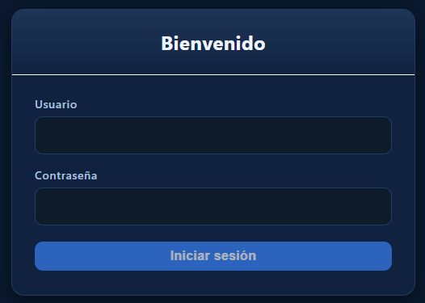
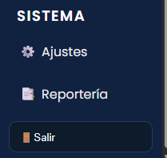
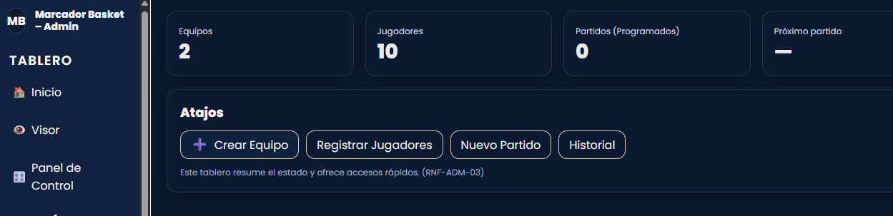
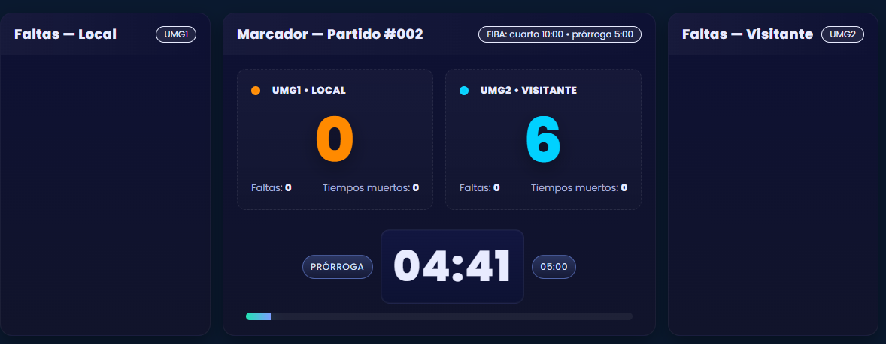
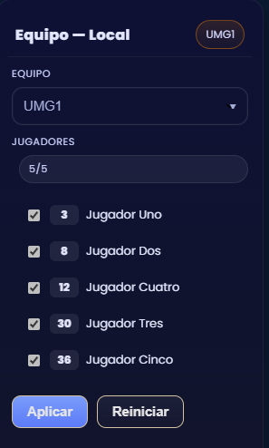
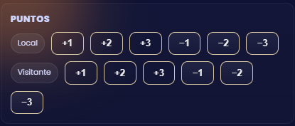
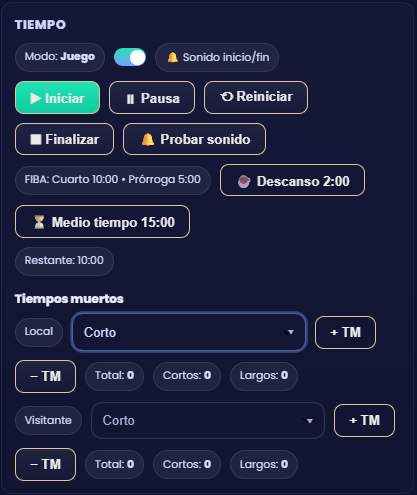
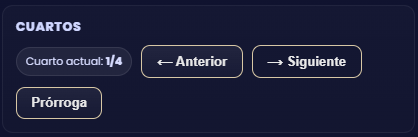
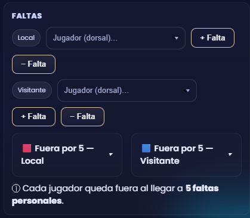
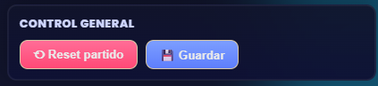

# 🏀 Manual de Usuario – Sistema Web de Marcador y Reportería de Baloncesto

---

## 📘 Introducción
**Sistema Web de Marcador y Reportería de Baloncesto** es una aplicación web diseñada para la gestión y visualización de partidos de baloncesto en tiempo real.  
Permite controlar el marcador, administrar equipos y jugadores, programar partidos y generar reportes en PDF.

El sistema está dividido en tres módulos principales:
1. **Tablero** – Control en tiempo real del marcador y partido.  
2. **Administración** – Gestión de equipos, jugadores y partidos.  
3. **Reportería** – Generación de reportes en PDF de información del sistema.
---

## ⚙️ Requisitos del sistema

### 📦 Requisitos de software

| Componente | Versión recomendada | Descripción |
|-------------|--------------------|--------------|
| **Frontend** | Angular 18+ | Interfaz principal del sistema |
| **Backend** | .NET 8+ / Laravel 12.x | API para autenticación, administración y reportería |
| **PHP** | 8.2+ | Generación de reportes PDF en backend |
| **Composer** | 2.x | Dependencias de Laravel |
| **Node.js / npm** | 20+ / 10+ | Dependencias de Angular |
| **Base de datos** | SQL Server (Marcador) / MySQL (Reportería) | Origen y destino de datos |
| **Servidor** | GNU/Linux (VPS) | Despliegue de la aplicación |
| **Navegador compatible** | Chrome, Edge, Firefox | Recomendados para mejor rendimiento |

### 💻 Requisitos de hardware

| Recurso | Mínimo | Recomendado |
|----------|---------|-------------|
| CPU | Intel i5 | Intel i7 o superior |
| RAM | 8 GB | 16 GB |
| Espacio libre en disco | 2 GB | 5 GB |

---

## 🔐 Autenticación con JWT

El sistema implementa autenticación **segura mediante JSON Web Tokens (JWT)** para los usuarios.

### 🔑 Pasos para iniciar sesión

1. Ingrese a la URL del sistema: http://localhost:4200/login

2. Introduzca sus credenciales (usuario y contraseña).

3. Al iniciar sesión correctamente, se genera un **token JWT**, que:
- Se almacena en el navegador.
- Permite acceder a los módulos protegidos (Administración y Reportes).
- Expira automáticamente después de cierto tiempo de inactividad.

### 🔒 Cierre de sesión

- Haga clic en salir (abajo a la izquierda), redirige a la pantalla de login.  
- Esto eliminará el token JWT y redirigirá al login.

---
## 🧭 Navegación Principal

El menú lateral izquierdo contiene los módulos del sistema:

| Sección | Descripción |
|----------|--------------|
|  **Inicio** | Resumen general del sistema (equipos, jugadores, partidos). |
| **Visor** | Marcador visual para mostrar el partido en tiempo real. |
| **Panel de Control** | Control completo del marcador, tiempos, faltas y cuartos. |
| **Equipos** | Administración de equipos (crear, editar, eliminar). |
| **Jugadores** | Registro y gestión de jugadores asociados a equipos. |
| **Partidos** | Programación de partidos y asignación de rosters. |
| **Reportería** | Generación de reportes PDF del sistema. |
| **Historial** | Historial de partidos jugados. |
| **Ajustes** | Gestión de usuarios. |

---
## 🏀 Módulo Tablero

### Inicio
Pantalla de resumen general del sistema.  
Muestra contadores de **equipos**, **jugadores** y **partidos programados**, con accesos rápidos para:

- Crear equipos 
- Registrar jugadores  
- Programar nuevos partidos  
- Ver historial de partidos

---
### Visor
Pantalla destinada a mostrar el marcador en tiempo real.

- Visualiza los puntos de ambos equipos.  
- Indica el cuarto actual y el temporizador.  
- Muestra las faltas y tiempos muertos.  

---
### Panel de Control
Interfaz administrativa para el anotador o árbitro principal.  

#### 🕹️ Controles disponibles:
- **Equipos y jugadores:** permite seleccionar equipos y roster de jugadores.

- **Puntos:** sumar o restar 1, 2 o 3 puntos. 

- **Tiempo:** iniciar, pausar, reiniciar y finalizar el reloj.  
- **Tiempos muertos:** agregar o restar tiempos cortos/largos. 

- **Cuartos:** avanzar, retroceder o iniciar prórroga. 

- **Faltas:** registrar faltas por jugador (5 faltas = fuera del juego).

- **Control general:** reiniciar o guardar partido.

---