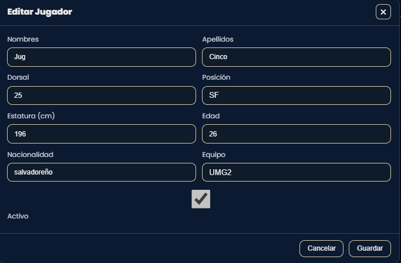
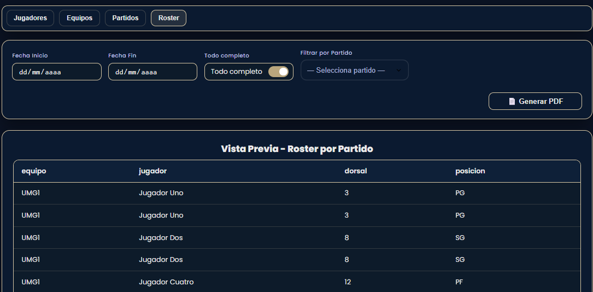

# Manual de Usuario – Sistema Web de Marcador y Reportería de Baloncesto

**Fecha:** Octubre 2025  
**Versión:** 1.0  


---

## Introducción
El Sistema Web de Marcador y Reportería de Baloncesto es una aplicación desarrollada para la gestión integral de partidos de baloncesto, permitiendo registrar resultados en tiempo real, administrar equipos y jugadores, y generar reportes automáticos en formato PDF.

El sistema está compuesto por tres módulos principales:

1. **Tablero** – Control en tiempo real del marcador y del partido.  
2. **Gestión** – Administración de equipos, jugadores y partidos.  
3. **Reportería** – Generación de reportes detallados en PDF.  

---

## Requisitos del sistema
### Requisitos de Software

| Componente | Versión recomendada | Descripción |
|-------------|--------------------|--------------|
| **Frontend** | Angular 18+ | Interfaz principal del sistema |
| **Backend (Marcador)** | .NET 8+ | Control de marcador y lógica de juego |
| **Backend (Reportería)** | Laravel 12.x / PHP 8.2+ | Generación de reportes PDF y API REST |
| **Composer** | 2.x | Gestión de dependencias de Laravel |
| **Node.js / npm** | 20+ / 10+ | Dependencias de Angular |
| **Base de datos** | SQL Server / MySQL | Origen (Marcador) y destino (Reportería) |
| **Servidor** | GNU/Linux (VPS o local) | Entorno de despliegue |
| **Navegador compatible** | Chrome, Edge, Firefox | Recomendados por compatibilidad |

### Requisitos de Hardware

| Recurso | Mínimo | Recomendado |
|----------|---------|-------------|
| CPU | Intel i5 | Intel i7 o superior |
| RAM | 8 GB | 16 GB |
| Espacio libre en disco | 2 GB | 5 GB |

---

## Autenticación con JWT

El sistema implementa autenticación segura mediante JSON Web Tokens (JWT) para los usuarios.

### Iniciar sesión

1. Ingrese a: **http://localhost:4200/login**
2. Introduzca su usuario y contraseña.  
3. Si las credenciales son válidas, se generará un token JWT que:
   - Se almacena localmente en el navegador.  
   - Permite acceder a los módulos protegidos.  
   - Expira tras un tiempo de inactividad.  


### Cierre de sesión
- Presione **Salir** (parte inferior izquierda).  
- El sistema elimina el token JWT y redirige al login.


---
## Navegación Principal

El menú lateral izquierdo contiene los módulos del sistema:

| Módulo | Descripción |
|--------|--------------|
| **Inicio** | Panel principal con resumen general |
| **Visor** | Vista pública del marcador en tiempo real |
| **Panel de Control** | Control total del marcador, tiempos y faltas |
| **Equipos** | Gestión de equipos registrados |
| **Jugadores** | Administración de jugadores |
| **Partidos** | Programación y control de partidos |
| **Reportería** | Generación de reportes PDF |
| **Historial** | Consulta de partidos finalizados |
| **Ajustes** | Gestión de usuarios y contraseñas |

---
## Módulo Tablero

### Acceso al Módulo

Desde el menú lateral, en la sección **Tablero**.  
Este módulo está compuesto por tres subpantallas principales:

- **Inicio** – resumen general del sistema.  
- **Visor** – marcador en tiempo real.  
- **Panel de Control** – interfaz administrativa para control de juego.

---
### Submódulos
#### Inicio
Pantalla principal con resumen del sistema:
- Total de equipos  
- Total de jugadores  
- Partidos programados  
- Próximo encuentro  

Incluye accesos directos para crear equipos, registrar jugadores y programar partidos.


---
#### Visor
Muestra el marcador en tiempo real:
- Puntos por equipo  
- Cuarto actual y tiempo restante  
- Faltas y tiempos muertos  


---
#### Panel de Control
Interfaz del anotador o árbitro principal.  
Permite controlar todos los aspectos del partido.

#### Controles disponibles:
- **Equipos y jugadores:** selección y asignación de rosters.  


- **Puntaje:** suma o resta de 1, 2 o 3 puntos.  


- **Tiempo:** iniciar, pausar, reiniciar y finalizar el reloj.  
- **Tiempos muertos:** agregar o restar tiempos cortos/largos. 


- **Cuartos:** avanzar, retroceder o iniciar prórroga. 


- **Faltas:** registrar faltas por jugador (5 faltas = fuera del juego).


- **Control general:** reiniciar o guardar partido.


---
## Módulo de Gestion
Interfaz administrativa para la gestión de equipos, jugadores, partidos e historial de juegos.

### Acceso al Módulo

Desde el menú lateral, en la opción **Gestión**.  
Este módulo agrupa las siguientes secciones:

- **Equipos** – administración de equipos.  
- **Jugadores** – registro y edición de jugadores.  
- **Partidos** – programación de encuentros.  
- **Historial** – consulta de resultados anteriores.

### Gestión de Equipos
- Crear, editar o eliminar equipos.  
- Campos: nombre, ciudad, abreviatura, logo, estado activo.  
- Visualización en tabla.
- Filtro de búsqueda y visualización en tabla.  


#### Crear Equipo
- Clic en **Nuevo Equipo**.
- Llenar los campos solicitados.
- Clic en **Guardar**.


#### Editar Equipo
- Selecciona el equipo y clic en **Editar**.
- Habilita los campos que el usuario desea cambiar.
- Clic en **Guardar**.


---
## Gestión de Jugadores
- Registrar jugadores asociados a un equipo.  
- Campos: nombres, dorsal, posición, estatura, edad, nacionalidad, equipo, estado activo.  
- Permite edición o eliminación de registros.   


#### Crear Jugador
- Clic en **Nuevo Jugador**.
- Llenar los campos solicitados.
- Clic en **Guardar**.


#### Editar Jugador
- Selecciona a jugador y clic en **Editar**.
- Habilita los campos que el usuario desea modificar.
- Clic en **Guardar**.


---
### Gestión de Partidos
- Programar partidos entre dos equipos.  
- Asignar roster de jugadores (por equipo).  
- Registrar fecha y hora del partido.  
- Permite editar y eliminar partidos existentes.
- Consultar historial de partidos jugados.


#### Crear Partido
- Clic en **Nuevo Partido**.
- Llenar los campos solicitados.
- Clic en **Guardar**.


#### Editar Partido
- Selecciona un partido y clic en **Editar**.
- Habilita los campos que el usuario desea modificar.
- Clic en **Guardar**.


#### Asignar Roster de jugadores
 - Selecciona un partido y clic en **Roster**.
 - Habilita la pantalla para seleccionar jugadores.
 - Clic en **Guardar**.

 

---
### Historial de partidos
- Consultar historial de partidos jugados.
- Ver marcadores finales.
- Filtrar por equipo.


---
## Módulo de Reportería

Permite generar reportes PDF desde el microservicio de reportería.

### Acceso al módulo
1. Ingrese al menú Sistema, clic en en submódulo.  
2. Seleccione el tipo de reporte (Jugadores, Equipos, Partidos o Roster).  
3. Use los filtros disponibles (rango de fechas o equipo).  
4. Haga clic en **Generar PDF** para descargarlo.

### Tipos de Reporte
| Reporte | Descripción |
|----------|--------------|
| **Equipos Registrados** | Lista con todos los equipos, ciudad, logo y estado. |
| **Jugadores por Equipo** | Jugadores de un equipo con sus datos principales. |
| **Historial de Partidos** | Muestra partidos jugados con fecha, hora y marcador final. |
| **Roster por Partido** | Jugadores asignados por cada equipo en un partido. |


#### Ejemlos de reportes
Vistas previas

#### Jugadores
 


#### Equipos

 

#### Partidos

 

#### Roster



---

## Módulo de Ajustes
El módulo Ajustes permite la administración de usuarios, roles y contraseñas dentro del sistema.  
Desde esta sección los administradores pueden crear nuevos usuarios, modificar sus datos, restablecer contraseñas y administrar su estado (activo/inactivo).

---

### Acceso al Módulo

Desde el menú lateral, selecciona la opción **Ajustes**.
Esto abrirá la vista principal del módulo, dividida en tres secciones principales:

- **Crear / Editar Usuario**
- **Restablecer Contraseña**
- **Resumen General y Listado de Usuarios**

---

### Crear un nuevo usuario

1. Completa los campos obligatorios marcados con `*`:
   - **Primer nombre**
   - **Primer apellido**
   - **Usuario** 
   - **Contraseña**
2. Opcionalmente, puedes agregar:
   - **Segundo nombre**
   - **Segundo apellido**
   - **Correo electrónico**
   - **Rol** (por defecto `USUARIO`, aunque puede asignarse `ADMINISTRADOR`)
3. Presiona el botón **“Crear Usuario”** para guardar el nuevo registro.


> Al crear un usuario, este queda **activo** automáticamente y podrá iniciar sesión con las credenciales asignadas.

---

### Editar un usuario existente

1. En el listado inferior, busca el usuario por nombre, número de usuario o correo.  
2. Presiona el botón Editar.
3. Modifica los campos necesarios y guarda los cambios con **“Guardar”**.

-  Buscar el usuario a editar.


- Vista de los campos a editar


---

### Restablecer Contraseña

La sección Restablecer contraseña permite cambiar la clave de acceso de un usuario existente.

1. Ingresa el número de usuario (NO. usuario) en el campo de búsqueda.
2. Una vez seleccionado, el sistema mostrará el usuario en el campo “Seleccionado”.
3. Introduce la nueva contraseña en el campo correspondiente.
4. Presiona el botón **Cambiar** para aplicar la nueva clave.


---

### Resumen del Sistema

El cuadro Resumen ubicado en la parte superior derecha muestra información general del sistema:

| Campo | Descripción |
|-------|--------------|
| **Usuarios** | Total de usuarios registrados en el sistema |
| **Activos** | Usuarios que actualmente tienen acceso habilitado |
| **Roles** | Cantidad de roles definidos


Este resumen se actualiza automáticamente con cada operación realizada.

---

### Usuarios del Sistema

La tabla Usuarios del sistema lista todos los usuarios registrados con los siguientes datos:

| Columna | Descripción |
|----------|-------------|
| USUARIO | Número único asignado al usuario |
| NOMBRE | Nombre completo |
| CORREO | Correo electrónico registrado |
| ROL | Rol asignado (`ADMINISTRADOR` o `USUARIO`) |
| ESTADO | Muestra si el usuario está `Activo` o `Inactivo` |

---

### Acciones disponibles por usuario

Cada registro tiene tres botones de acción:

| Botón | Descripción |
|--------|--------------|
| **Editar** | Permite modificar los datos del usuario seleccionado |
| **Desactivar** | Cambia el estado del usuario a `Inactivo`, bloqueando su acceso |
| **Eliminar** | Elimina completamente el usuario del sistema |

>Solo los usuarios con rol **ADMINISTRADOR** pueden eliminar o desactivar cuentas.

---

## Preguntas Frecuentes (FAQ)
A continuación se presenta una lista de preguntas y respuestas comunes que ayudan a resolver dudas sobre el uso del sistema, su configuración y funcionamiento general.

---
##### ¿Qué hago si no puedo iniciar sesión?
- Verifica que el usuario y contraseña sean correctos.  
- Asegúrate de que el servidor backend (.NET o Laravel) esté en ejecución.  
- Si el error persiste, borra los datos del navegador (localStorage) e intenta nuevamente.  
- En caso de olvido de contraseña, solicita un restablecimiento desde el módulo **Ajustes**.

##### ¿Por qué el marcador no se actualiza en el visor?
- Comprueba que el panel de control esté abierto y el partido activo.  
- Asegúrate de que ambos equipos estén seleccionados.  
- Si el problema persiste, actualiza la página del visor y revisa la conexión con el backend.

##### ¿Cómo filtro jugadores por equipo en el módulo de reportería?
- Selecciona la pestaña **Jugadores**.  
- En el campo **Filtrar por equipo**, elige el equipo deseado.  
- Los datos se actualizarán automáticamente en la tabla de vista previa.  
- Luego, presiona **Generar PDF** para obtener el reporte filtrado.

##### ¿Qué hacer si el sistema muestra “ECONNREFUSED 127.0.0.1:8000”?
- Este error indica que el backend Laravel no está activo.  
- Ejecuta el comando:
  ```bash
  php artisan serve

##### ¿Cómo agrego nuevos usuarios al sistema?
- Accede al módulo Ajustes → Crear usuario.
- Completa los campos requeridos (nombre, usuario, contraseña).
- Guarda el registro. El nuevo usuario quedará activo automáticamente.

##### ¿Qué roles existen en el sistema?
- ADMINISTRADOR: tiene acceso completo a todos los módulos, incluyendo ajustes y reportería.
- USUARIO: puede acceder a los módulos de tablero, gestión y reportes, pero no crear o eliminar usuarios.

##### ¿Puedo personalizar el formato de los reportes?
- Sí, desde el backend Laravel, en las plantillas ubicadas en:

   resources/views/pdf/
- Puedes modificar colores, logotipos o agregar encabezados personalizados.

##### ¿Qué hacer si no aparecen datos en la vista previa de reportería?
- Verifica que las vistas SQL (vw_report_...) existan en la base de datos.
- Ejecuta nuevamente el script de creación de vistas desde MySQL.
- Comprueba que la tabla tenga datos actualizados.


© 2025 Sistema Web de Marcador y Reportería de Baloncesto
