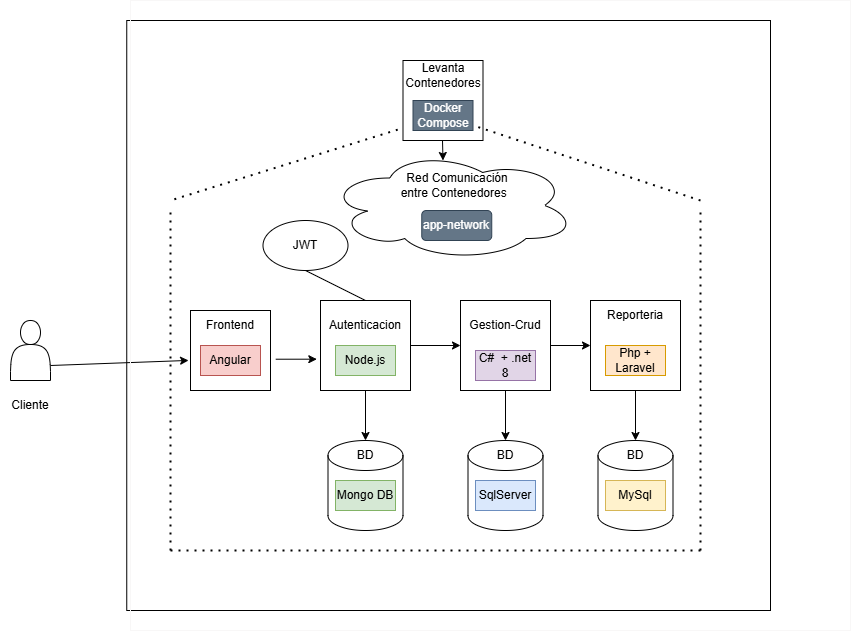
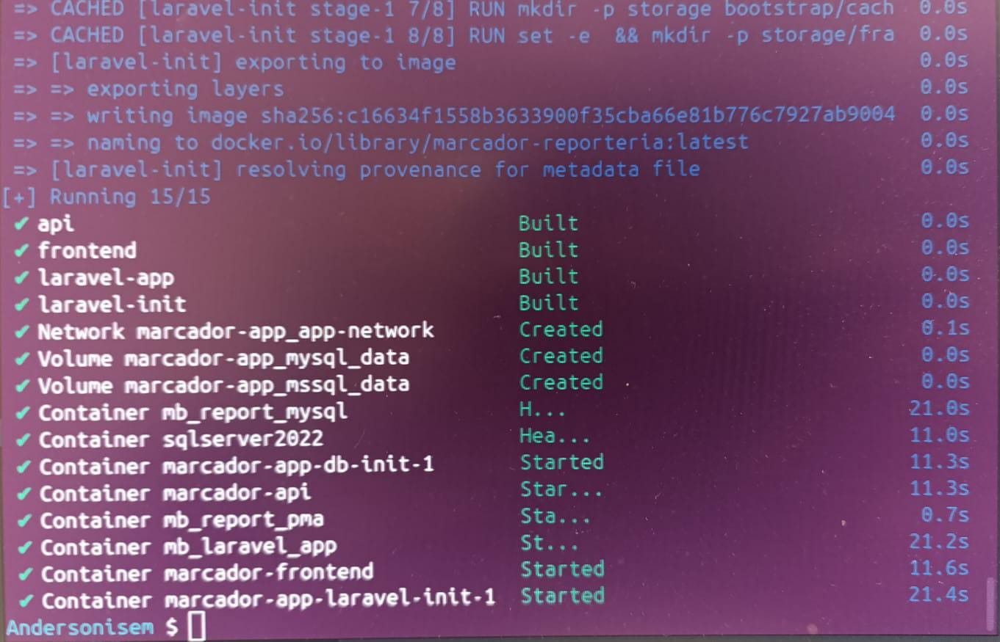

## Aplicacion web Tablero Basketball 

*Se realizó una refactorización  de la arquitectura, separando la aplicación en distintos servicios para mejorar la escalabilidad y el mantenimiento. Además se incorporaron nuevos módulos de reportería y autenticación.*

*La autenticación, que anteriormente se desarrollo en .Net 8, fue migrada a Node.js, adoptando un enfoque de microservicio independiente.*

*El sistema continúa gestionando la información relacionada con equipos, jugadores y partidos, pero ahora cuenta con una estructura más modular.*

### Diagrama Arquitectura

### Microservicios y Lenguajes

**Microservicio Api** 

*Desarrollado en C# y .net 8. Este servicio gestiona la lógica central del tablero de básquet, incluyendo la gestion de equipos, jugadores y partidos, utiliza SQL Server como base de datos.*

**Microservicio Api-auth**

*Desarrollado en Node.js, servicio encargado de la autenticacion y autirazion de los roles del usuario, este modulo implementa JWT para la seguridad, utiliza como base de datos MongoDb.*

**Microservicio Reporteria**

*Desarrollado en Php y Laravel, servicio que se encarga de gestionar y generar reporter en pdf, teniendo en cuenta la informacion proveniendo de los demas servicios como el de api, utiliza como base de datos MySql.*

### Levantar sistema localmente (Docker, comandos, puertos)

Requisitos tener docker Desktop, docker compose y de igual manera tener libres los puertos descritos a continuacion.

#### puertos

 - SqlServer localhost:1433
 - MySql localhost: 3306/7
 - MongoDB localhost: 27018
 - node.js localhost: 3000
 - php(laravel) localhost: 8000
 - C#(.net 8) localhost5080
 - angular localhost: 4200

 ### Comando para levantar Sistema

 docker compose up -d --build
 
   - El siguiente comando lee el docker-compose.yml que contiene todos los servicios (SqlServer, front, api, etc).

   - construye las imagenes 

   - crea los contenedores ( apartir de las imagenes)

   - crea los volumenes (bases de datos persistencia)

   - Levanta todos los servicios 

   - Conecta todos los contenedores en la red interna app-network

   si todo corre como se espera deberias ver todos los contendores creados correctamente.

   

   ### Endpoints De los nuevos Microservicios(Reporteria, Autenticacion con Node.js)

   #### **php/laravel**

   Equipos

| Método HTTP | Endpoint | Descripcion  |
|--------------|-----------|-------------------|
| **GET** | /api/report/equipos        | Vista previa paginada de equipos                |
| **GET** | /api/report/lookup/equipos | Lista simple de equipos (solo id y nombre)      |
| **GET** | /api/report/equipos/pdf    | Genera y descarga el PDF del reporte de equipos |

Jugadores 

| Método HTTP | Endpoint                     | Descripcion                                                      |
|--------------|------------------------------|------------------------------------------------------------------|
| **GET**          | /api/report/jugadores        | Vista paginada de jugadores con filtros opcionales               |
| **GET**          | /api/report/jugadores/pdf    | Genera y descarga el PDF del reporte de jugadores                |

Partidos
   

| Método HTTP | Endpoint                      | Descripcion                                            |
|--------------|-------------------------------|------------------------------------------------------------------|
| **GET**          | /api/report/partidos          | Vista paginada de partidos con filtros por fecha                 |
| **GET**          | /api/report/partidos/pdf      | Genera y descarga el PDF del reporte de partidos                 |

 

Roster

| Método HTTP | Endpoint                 | Descripcion                                                       |
|--------------|--------------------------|------------------------------------------------------------------|
| **GET**          | /api/report/roster       | Vista paginada del roster por partido, con filtros por fecha o ID |
| **GET**         | /api/report/roster/pdf   | Genera y descarga el PDF del reporte de roster por partido        |

#### **Node.js**

| Método | Endpoint         | Descripción                    |
| ------ | ---------------- | ------------------------------ |
| **POST** | /auth/register | Registro de nuevo usuario      |
| **POST** | /auth/login    | Autenticación con JWT |

